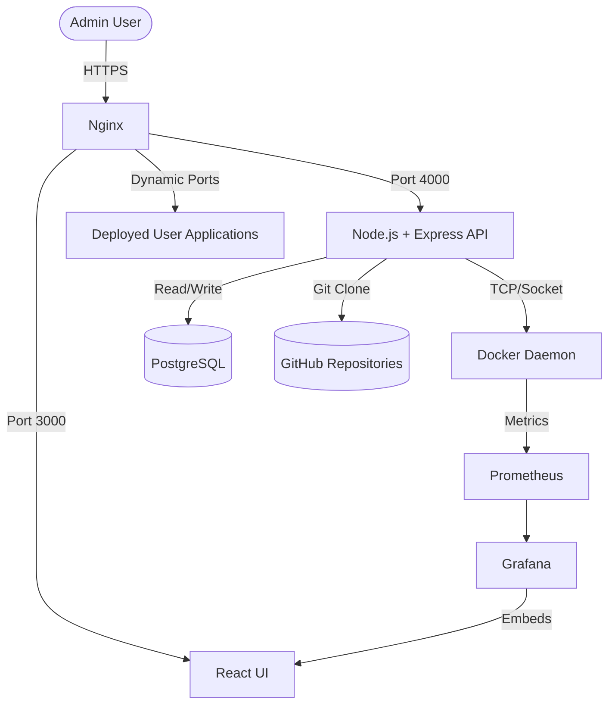
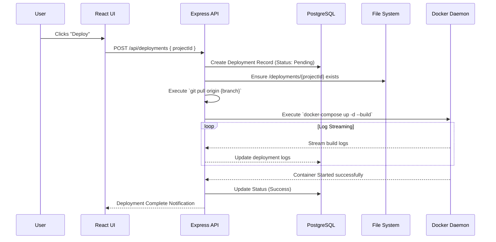
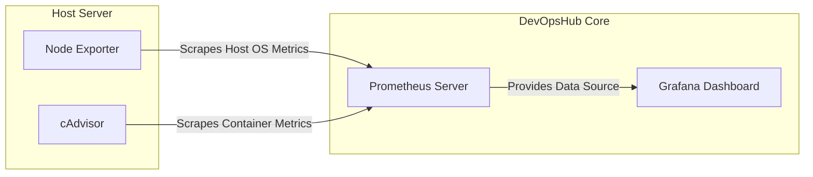
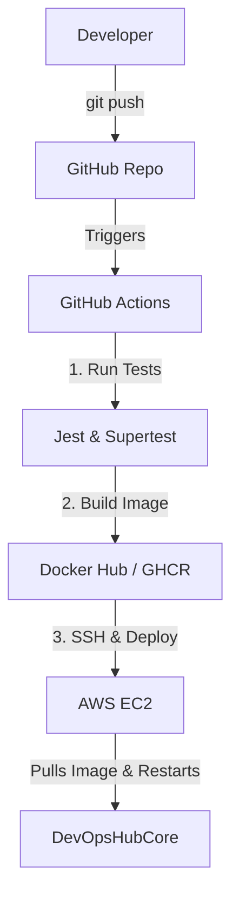

# Task 5: Software Architecture Design

This document details the architectural blueprints for DevOpsHub. It ensures a clear separation of concerns, scalability, and adherence to the ₹0 budget constraint.

---

## 1. High-Level Architecture (HLA)

DevOpsHub acts as a control plane sitting on the same server as the data plane (the user's deployed applications). 

---

## 2. Low-Level Architecture (LLA)

### Application Flow (Deployment Execution)

When a user clicks "Deploy", the following sequence occurs internally:

---

## 3. Deployment Architecture (AWS Free Tier)

DevOpsHub is designed to be hosted on a single AWS EC2 `t2.micro` or `t3.micro` instance (1 vCPU, 1GB RAM) running Ubuntu 22.04/24.04.

---

## 4. Docker Architecture

We utilize two conceptual networks within the Docker environment:
1. **`devopshub-network`**: Contains the core platform (Frontend, Backend, DB, Prometheus, Grafana). These services can talk to each other but are isolated from user apps.
2. **`user-apps-network`**: User deployments are placed here.

The Express API mounts the host machine's `/var/run/docker.sock`. This allows the Node container to spin up sibling containers on the host machine.

---

## 5. Monitoring & Data Flow Diagram

---

## 6. CI/CD Architecture for DevOpsHub Itself

How do we deploy updates to the DevOpsHub code itself?
We use **GitHub Actions**.

---

## 7. Rollback Flow Architecture

Rollbacks are handled by checking out previous Git commits.

1. User selects a previous successful deployment.
2. Backend queries the database for the `commit_id` of that deployment.
3. Backend runs:
   - `cd /deployments/{projectId}`
   - `git fetch`
   - `git checkout {commit_id}`
   - `docker-compose up -d --build`
4. Re-exposes the rolled-back container to Nginx.
