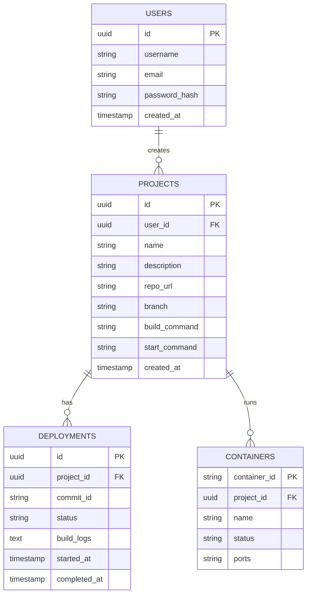

# Task 6: Database Design

DevOpsHub uses **PostgreSQL**. It is robust, highly relational, and handles concurrent transactions well (essential for updating deployment statuses and streaming logs).

---

## 1. Entity Relationship (ER) Diagram

---

## 2. Table Definitions

### Table: `users`
| Column Name | Data Type | Constraints | Description |
| :--- | :--- | :--- | :--- |
| `id` | UUID | PRIMARY KEY, DEFAULT gen_random_uuid() | Unique identifier. |
| `username` | VARCHAR(50) | UNIQUE, NOT NULL | Admin username. |
| `email` | VARCHAR(255)| UNIQUE, NOT NULL | Admin email. |
| `password_hash` | VARCHAR(255)| NOT NULL | bcrypt hashed password. |
| `created_at` | TIMESTAMP | DEFAULT NOW() | Record creation time. |

### Table: `projects`
| Column Name | Data Type | Constraints | Description |
| :--- | :--- | :--- | :--- |
| `id` | UUID | PRIMARY KEY, DEFAULT gen_random_uuid() | Unique identifier. |
| `user_id` | UUID | FOREIGN KEY (users.id) ON DELETE CASCADE | Owner of the project. |
| `name` | VARCHAR(100) | UNIQUE, NOT NULL | E.g., "my-portfolio". |
| `repo_url` | VARCHAR(255)| NOT NULL | GitHub HTTP clone URL. |
| `branch` | VARCHAR(50) | DEFAULT 'main' | Branch to deploy. |
| `env_vars` | JSONB | NULL | Encrypted environment variables. |
| `created_at` | TIMESTAMP | DEFAULT NOW() | Record creation time. |
| `updated_at` | TIMESTAMP | DEFAULT NOW() | Last modified time. |

### Table: `deployments`
| Column Name | Data Type | Constraints | Description |
| :--- | :--- | :--- | :--- |
| `id` | UUID | PRIMARY KEY, DEFAULT gen_random_uuid() | Unique identifier. |
| `project_id` | UUID | FOREIGN KEY (projects.id) ON DELETE CASCADE | Associated project. |
| `commit_id` | VARCHAR(40) | NULL | Git SHA of the deployed commit. |
| `status` | VARCHAR(20) | NOT NULL (PENDING, BUILDING, SUCCESS, FAILED) | Current state. |
| `build_logs` | TEXT | NULL | CLI output from docker build. |
| `started_at` | TIMESTAMP | DEFAULT NOW() | When deployment began. |
| `completed_at`| TIMESTAMP | NULL | When deployment finished. |

---

## 3. Indexes & Performance Optimization
- `CREATE INDEX idx_project_user ON projects(user_id);` (To quickly load projects for a user).
- `CREATE INDEX idx_deployment_project ON deployments(project_id);` (To quickly load deployment history for a specific project).
- `CREATE INDEX idx_deployment_status ON deployments(status);` (Useful for a dashboard widget showing "Failed Deployments").

## 4. Normalization
The database is in **3rd Normal Form (3NF)**.
- Every non-key attribute is dependent only on the primary key.
- Transitive dependencies are removed (e.g., we do not store the repo URL inside the `deployments` table; we reference `project_id`).

## 5. Migration Strategy
We will use **Prisma ORM** or **Knex.js** to manage schema migrations.
Prisma provides a `schema.prisma` file which acts as the single source of truth and automatically generates highly-typed SQL migrations, fitting perfectly with our TypeScript stack.

## 6. Backup Strategy
- **Automated Cron Job:** A bash script running daily at 02:00 AM.
- **Command:** `pg_dump -U postgres -d devopshub_db > backup_$(date +%F).sql`
- **Retention:** Backups are gzipped and sent to an AWS S3 bucket using the AWS CLI, retaining only the last 7 days.
